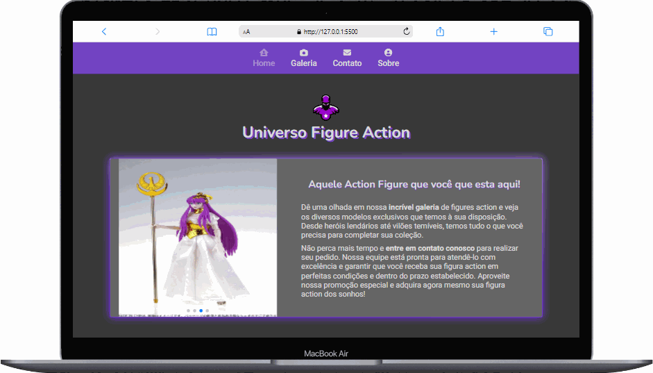

  

    <h2 align="center"> Universo Action Figure </h2>
    
    

    <a href="https://universo-action-figures.vercel.app/">Link do site</a>
    

    <h1>🚀Academia .Net Atos UFN🚀</h1>
  

  <h2 align="center">🚀 Desafio HTML/CSS🧑‍🎓</h2>  
  <h5>
    Desenvolva um site para uma empresa, com todas informações da empresa. A
    página deve possuir, no mínimo, os seguintes requisitos (ou reutilize uma já
    desenvolvida que possua no mínimo 4 páginas html):
  </h5>
  <ul>
    <li>
      Página inicial: crie uma página inicial que apresente uma breve introdução
      ao site e tenha um menu de navegação com links para outras páginas do
      site.
    </li>
    <li>
      Página "Sobre": crie uma página "Sobre" que inclua informações sobre o
      criador do site e sua finalidade.
    </li>
    <li>
      Página "Contato": crie uma página "Contato" que inclua um formulário de
      contato básico com campos para nome, email e mensagem. Após clicar em
      enviar, será encaminhada para uma página onde aparecerá a mensagem que foi
      enviada e terá a possibilidade de voltar para a página inicial.
    </li>
    <li>
      Página "Galeria": crie uma página "Galeria" que inclua uma galeria de
      imagens relacionadas ao tema do site.
    </li>
    <li>
      Em alguma das páginas deve existir uma tabela onde apresente dados, por
      exemplo, dados comparativos de modelos de algum aparelho.
    </li>
  </ul>
  

    Além disso, o menu de navegação deverá existir em todas as páginas para que
    possibilite a navegação completa em todas as páginas.
  

  

    Faça com que as páginas HTML possuam no minimo 4 classes distintas. Cada
    classe deverá ter propriedades alteradas, busque ter no minimo 5
    propriedades no CSS.
  

  

    Além disso, faça aplicação de estilos em elementos utilizando ID. Utilize
    divs para auxiliar.
  

  
Busque uma interface agradável aos olhos do usuário.

  

    Na elaboração das páginas, utilize as tags que possuem ênfase na melhora do
    SEO do site proposto.
  

